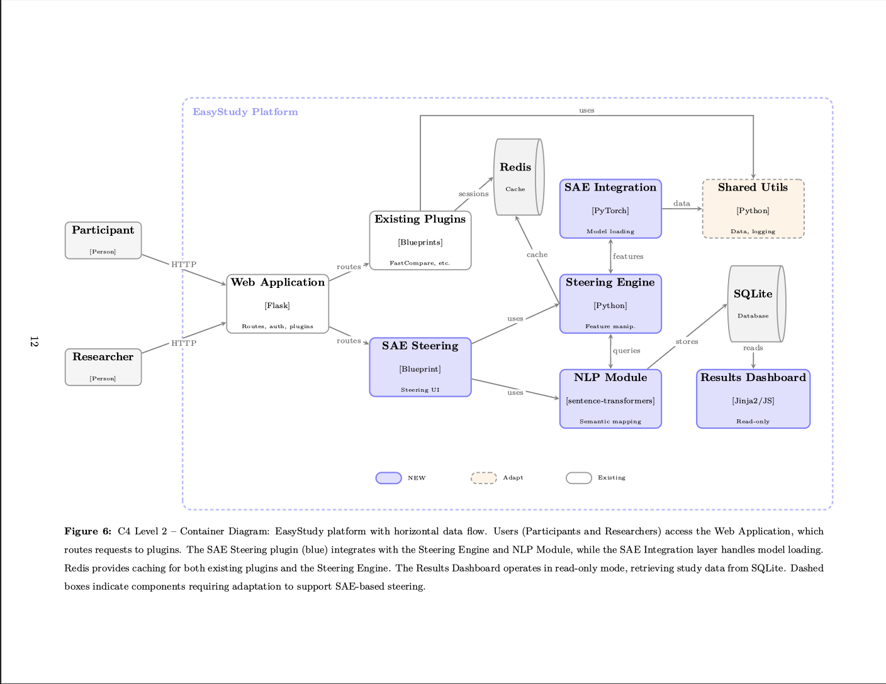
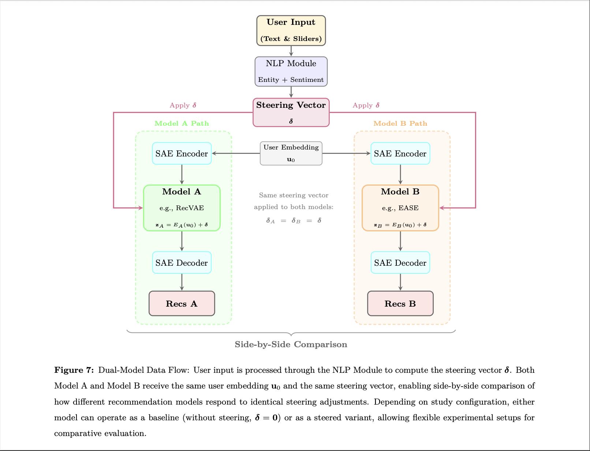
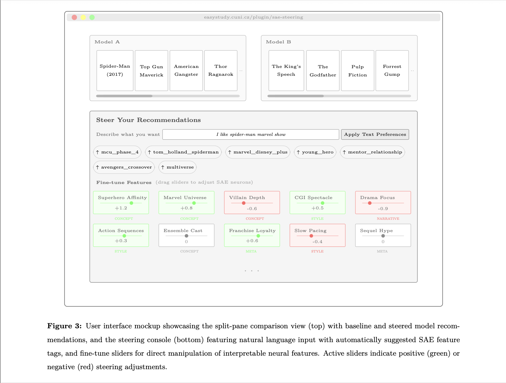

# Steering Neural Recommenders with Sparse Autoencoders

> Fork of [EasyStudy](https://github.com/pdokoupil/EasyStudy) for interactive SAE-based recommendation steering.

Collaborative filtering models learn powerful latent representations, but these embeddings suffer from **representation entanglement** - individual neurons are polysemantic, encoding multiple unrelated concepts simultaneously. This makes the models opaque and difficult to control.

**Sparse Autoencoders (SAE)** offer a solution. By projecting dense embeddings into a high-dimensional sparse space, SAEs learn disentangled features that often align with human-understandable concepts. Users can then directly manipulate these features to **steer** recommendations - boosting or suppressing specific aspects in real-time.

This repository demonstrates the steering capability through an interactive web application, part of the [Sparse4RESS](_) tutorial on sparse representations for recommendation explanations, steering, and segmentation.

## Key Features





The [sae_steering](./server/plugins/sae_steering/) plugin provides:

- **Slider steering** - continuous adjustment of individual SAE neurons
- **Text steering** - natural language queries converted to neuron activations via Sentence-BERT
- **A/B comparison** - side-by-side evaluation of different model configurations
- **Full interaction logging** - all steering actions captured for research analysis

## Quick Start

Requires Python 3.9 and Redis. The SAE checkpoint is downloaded separately from GitHub Releases into `server/plugins/sae_steering/models/`.

```bash
# Setup
cd server
python3.9 -m venv .venv39 && source .venv39/bin/activate
pip install -r pip_requirements.txt

# Download the required SAE model
python plugins/sae_steering/bootstrap_model.py

# Start Redis (in separate terminal)
brew install redis && brew services start redis

# Run
export FLASK_APP=app.py
flask --debug run
```

Open `http://localhost:5000`, create an SAE Steering study, and explore.

If the GitHub release asset uses a different filename, select it explicitly:

```bash
cd server
python plugins/sae_steering/bootstrap_model.py --asset-name model.pkl
```

## Docker Compose

For a CPU-only deployment, the repository now includes a `docker-compose.yml` that starts both the EasyStudy server and Redis. The container bootstraps the `WWW TopKSAE-8192` checkpoint from GitHub Releases on first start, and it can also download and extract the required `ml-latest` dataset asset automatically.

```bash
# If clone complains about git-lfs, either install git-lfs
# or clone once with:
# GIT_LFS_SKIP_SMUDGE=1 git clone https://github.com/vaclavstibor/SAE4EasyStudy.git

git clone https://github.com/vaclavstibor/SAE4EasyStudy.git
cd SAE4EasyStudy
docker compose up --build
```

By default, the container looks for these release assets:

- `www_TopKSAE_8192.ckpt`
- `ml-latest.zip`

Useful environment overrides:

```bash
SAE_MODEL_RELEASE_TAG=v1.0 docker compose up --build
SAE_MODEL_GITHUB_REPO=vaclavstibor/SAE4EasyStudy docker compose up --build
DATASET_RELEASE_TAG=v1.0 docker compose up --build
```

Persistent Docker volumes are used for:

- SQLite data in `/app/instance`
- runtime cache in `/app/cache`
- downloaded SAE models in `/app/plugins/sae_steering/models`

The `ml-latest.zip` asset should already contain the `img/` directory with poster JPGs. It is extracted into `/app/static/datasets/ml-latest`, so the resulting structure contains both the CSV files and `/app/static/datasets/ml-latest/img`.

## EasyStudy Framework

Built on [EasyStudy](https://github.com/pdokoupil/EasyStudy) by [Patrik Dokoupil](mailto:patrik.dokoupil@matfyz.cuni.cz) and [Ladislav Peska](mailto:ladislav.peska@matfyz.cuni.cz). For deployment details, dataset setup, and Docker configuration, refer to the original [documentation](https://github.com/pdokoupil/EasyStudy#readme).

lsof -ti:5000 | xargs kill -9 2>/dev/null; echo "done"
I like spiderman from marvel cinematic universe but dislike dc 