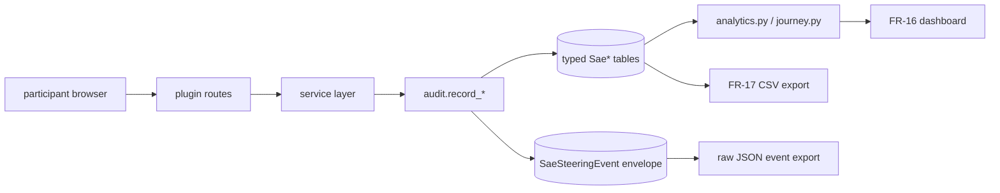
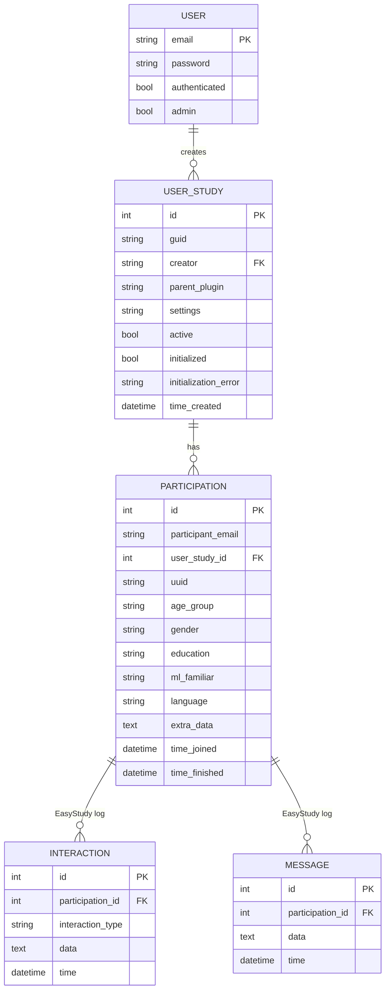

# Technical Documentation

**Project**: SAE-Based Interpretable Neural Steering for Recommendation Systems  
**Type**: Research project — extends [pdokoupil/EasyStudy](https://github.com/pdokoupil/EasyStudy/tree/main/server)  
**Author**: Bc. Václav Stibor  
**Supervisor**: Mgr. Ladislav Peška, Ph.D.  
**Consultants**: RNDr. Patrik Dokoupil; Ing. Vojtěch Vančura, Ph.D.; Mgr. Martin Spišák; Mgr. Petr Škoda, Ph.D.  
**Institution**: Department of Software Engineering, Faculty of Mathematics and Physics, Charles University

This document is the technical reference for the application. Companion documents:

| File | Audience | Purpose |
| --- | --- | --- |
| [`design-decisions.md`](design-decisions.md) | reviewers, future maintainers | *Why* the architecture looks like this. Records the binding design choices. |
| [`formative-examples.md`](formative-examples.md) | future contributors | *How* to add a new plugin, modality, dataset, audit table — with code snippets. |
| [`equations.md`](equations.md) | reviewers, downstream researchers | The math behind every scoring function (text steering, SAE shifts, ELSA seed, reranking). |
| [`admin-manual.md`](admin-manual.md) | researchers running studies | Step-by-step usage of the admin UI and the export pipeline. |
| [`user-manual.md`](user-manual.md) | participants | What the study looks like from the participant's perspective. |

---

## 1. Abstract

This application is a plugin-first study framework for measuring **interpretable, controllable steering** of recommender systems through Sparse Autoencoder (SAE) features. It extends [pdokoupil/EasyStudy](https://github.com/pdokoupil/EasyStudy) — a study framework for recommender-system user research — with a new `sae_steering` plugin that lets a participant directly manipulate SAE-derived feature clusters (`sliders`, `toggles`, `text`, `examples`), reset their session, and compare multiple steering approaches in one study.

The thesis contribution is the **SAE Steering plugin** plus a structured audit pipeline that records every participant action as a typed database row. This enables column-driven analytics (per-approach mean-absolute adjustment, search-then-adjust funnels, reset frequency, text-steering match rates) instead of post-hoc JSON parsing. The application is delivered with a researcher dashboard (FR-16), a per-table CSV export (FR-17), and a complete admin/participant UI.

The framework preserves EasyStudy compatibility: existing EasyStudy plugins (`fastcompare`, `empty_template`, `utils`) run unchanged, and the platform half of this repository is a thin reshuffle of upstream EasyStudy with the same Flask blueprints and the same ORM models.

---

## 2. Introduction

### 2.1 Purpose

This document describes the runtime, the architecture, and the database schema of the framework. It is written for:

- thesis reviewers, who need a self-contained technical reference,
- the supervisor and consultants, who need to verify the implementation against `proposal.tex`,
- future maintainers, who need to extend the system without breaking EasyStudy parity.

### 2.2 Scope

The documentation covers:

- The platform half (`server/platform/`): Flask app factory, admin UI, auth, participant flow, persistence, plugin registry.
- The SAE Steering plugin (`server/plugins/steering/`): modalities, recommendation pipeline, audit service, analytics, templates, routes.
- The audit pipeline: typed tables, envelope rows, single-writer service.
- Outputs: FR-16 dashboard, FR-17 CSV export, per-participant journey timeline.
- Runtime and deployment: schema bootstrap, environment variables, Docker, production checklist.
- Testing strategy: pytest layout and what each test guards.

### 2.3 Lineage — extending EasyStudy

The application is a derivative of [pdokoupil/EasyStudy](https://github.com/pdokoupil/EasyStudy). The proposal (`proposal.tex`) was written against that base. The refactor preserves EasyStudy compatibility so future upstream upgrades drop in cleanly and any other EasyStudy-native plugins continue to work.

**What stayed from EasyStudy:**

| Upstream file | Where it lives here | Treatment |
| --- | --- | --- |
| `server/app.py` | `server/platform/app.py` | Renamed; same role (Flask app factory, login manager, plugin bootstrap). |
| `server/auth.py` | `server/platform/auth/` | Same role. |
| `server/main.py` | `server/platform/admin/routes.py` + `server/platform/participant_flow/routes.py` | Admin routes plus the EasyStudy plugin contract endpoints (`create`/`initialize`/`dispose`/`join`/`results`). |
| `server/models.py` | `server/platform/persistence/base_models.py` | Holds `User`, `UserStudy`, `Participation`, `Interaction`, `Message`. **Preserved verbatim.** |
| `server/common.py` | `server/platform/shared/common.py` | Same role. |
| `server/static/` | `server/static/` | Unchanged. |
| `server/plugins/{fastcompare, empty_template, utils}` | Same paths | **Kept verbatim** so future upstream upgrades drop in. |

**What we added:**

| Module | Purpose |
| --- | --- |
| `server/plugins/steering/` | The SAE-based interpretable steering plugin — the actual thesis work. Owns its blueprint, modalities, persistence models, analytics. |
| `server/platform/participant_flow/` | EasyStudy's participant-side pages pulled out of upstream `main.py` so the admin surface stays narrow. |
| `server/platform/runtime/` | `PluginMetadata`, `StudyPluginContract`, `load_canonical_plugin_contracts`, session-state helpers. |
| `server/platform/shared/questionnaire_cache.py` | Cross-plugin helper that caches questionnaire JSON per study. |

**What we deliberately did not touch:**

- `Interaction` and `Message` ORM models stay. `plugins/fastcompare` and `plugins/utils` still use `log_interaction` / `log_message` against those tables. The SAE Steering plugin does not write to them.
- The plugin contract (`create`/`initialize`/`dispose`/`join`/`results`). Every plugin still exposes these five entry points.
- `plugins/utils/interaction_logging.py` keeps `log_interaction`, `log_message`, `study_ended` as EasyStudy primitives. Only EasyStudy-native plugins call these.
- `server/platform/web/` is the upstream `server/templates/` directory; do not rename it.

**What we removed** (our additions that turned out to duplicate EasyStudy primitives):

- `server/plugins/steering/service/events.py`
- `server/platform/runtime/events.py`
- `server/platform/runtime/interaction_logging.py`
- `server/platform/runtime/interaction_routes.py`
- `server/plugins/steering/results/journey_builder.py`

The steering plugin now writes only to typed audit tables described in Section 5.

---

## 3. System Overview

### 3.1 What the framework does

1. **Recruits participants** for recommendation-system user studies (Prolific-compatible).
2. **Elicits initial preferences** via a movie picker (`/preference-elicitation`).
3. **Runs N iterations** of the steering loop per approach. Each iteration: show recommendations → participant likes/dislikes movies → participant steers (sliders / toggles / text / examples / reset) → recompute the next iteration. Whether the slider/toggle/text adjustments and the like-derived ELSA seed weighting persist from one iteration into the next is controlled by the per-study `interaction_mode` config key (`cumulative` default, or `reset` for fully independent iterations) — see [`equations.md`](equations.md) Section 2.1. The audit tables always record every iteration's actions regardless of the mode.
4. **Cycles through approaches** if the study compares multiple steering configurations (sequential mode).
5. **Collects questionnaires** between approaches and at the end.
6. **Records every action** as a typed audit row.
7. **Exposes analytics** via a researcher dashboard and a per-table CSV export.

### 3.2 Main features

| Feature | Backing FR | Module |
| --- | --- | --- |
| Slider steering (continuous boost/suppress per feature) | FR-05 | `modalities/sliders.py` |
| Toggle steering (binary boost / suppress / off) | FR-06, FR-07 | `modalities/toggles.py` |
| Natural-language steering with composition modes | FR-09 | `modalities/text.py` + `routes/steering/actions.py::parse_text_steering` |
| Example-based steering (use liked movies as steering seed) | FR-08 | `modalities/examples.py` |
| Dedicated `/reset` endpoint | FR-12 | `routes/steering/actions.py::reset_steering` |
| Configurable reranking strategy (three strategies) | FR-10 | `service/iteration_controller.py`, `recommendation/sae_recommender.py` |
| Per-session iteration history panel | FR-13 | `templates/steering_interface.html::renderActivityHistory` (client-side, scoped to one session) |
| Feature search inside the steering UI | thesis-added | `routes/steering/actions.py::search_features` |
| Researcher dashboard per approach | FR-16 | `results/analytics.py` |
| ZIP CSV export of every typed table | FR-17 | `routes/results/views.py::export_csv_data` |
| Per-participant journey timeline | FR-15 | `routes/results/journey.py` |
| Graceful "no-match" when text steering fails to map | NFR-12 | `routes/steering/actions.py::parse_text_steering` |

### 3.3 Technology stack

| Layer | Choice |
| --- | --- |
| Web framework | Flask 2.x |
| ORM | SQLAlchemy 2.x via Flask-SQLAlchemy |
| DB engine (dev) | SQLite |
| DB engine (prod) | PostgreSQL |
| Sessions | Flask-Session, SQLAlchemy-backed (swappable to Redis) |
| Auth | Flask-Login + Flask-WTF (CSRF) |
| Templates | Jinja2 |
| Frontend | Bootstrap-Vue, Chart.js, vanilla JS |
| App server | Gunicorn (`--preload` worker) |
| Test runner | pytest |
| Linter / formatter | ruff |
| ML stack | PyTorch + custom SAE / ELSA, MovieLens-32M-Filtered |

### 3.4 Schema management at a glance

- The platform's `server/platform/persistence/base_models.py` and each plugin's `persistence/models.py` are the **only** source of truth for the schema.
- `create_app()` calls `db.create_all()` on every boot — idempotent.
- `./scripts/init-db.sh` is the explicit, idempotent wrapper.
- `./scripts/reset-db.sh` is the destructive `drop_all()` + `create_all()` wrapper.

There is no migration framework. See [`design-decisions.md`](design-decisions.md) Section 3 for the rationale.

---

## 4. Architecture

### 4.1 Module map

```

  server/
    platform/                  framework-owned code (one-to-one with upstream EasyStudy roles)
      app.py                   create_app() factory, DB/session/login init
      admin/                   admin blueprint: /administration, study CRUD
      auth/                    /login, /register, /logout
      participant_flow/        /join, /preference-elicitation, /finish, /movie-search, /upload
      persistence/             User, UserStudy, Participation, Interaction, Message
      runtime/                 PluginMetadata, StudyPluginContract, plugin_registry, session helpers
      shared/                  common helpers (translations, questionnaire_cache)
      web/                     admin/auth Jinja templates (kept under this name for EasyStudy parity)
    plugins/
      steering/                SAE steering plugin (this thesis)
        constants.py           plugin-wide enums and defaults
        plugin.py              blueprint + StudyPluginContract export
        study_config.py        normalize_study_config + active-model resolution
        modalities/            sliders, toggles, text, examples (strategies)
        recommendation/        SAE recommender + semantic cluster registry
        service/               audit.py, iteration_controller.py, session_controller.py
        persistence/models.py  typed audit tables (Sae*)
        routes/                Flask routes (admin, api, results, steering, study)
        results/analytics.py   column-driven dashboard payload
        templates/             plugin Jinja templates
      fastcompare/             EasyStudy-native plugin (kept verbatim)
      empty_template/          EasyStudy-native plugin (kept verbatim)
      utils/                   EasyStudy-native cross-plugin primitives
    static/                    shared static assets (datasets, questionnaires, bootstrap-vue, ...)
    scripts/                   init_db.py, reset_db.py
  scripts/                     root-level wrappers (init-db.sh, reset-db.sh, run-dev.sh, test.sh)
  tests/                       canonical test root
```

There is intentionally no `migrations/` directory.

### 4.2 Plugin contract

Every plugin exposes a `StudyPluginContract` from its package via `get_plugin()`. The contract carries a metadata block and a Flask blueprint, and is registered by `server.platform.runtime.plugin_registry.load_canonical_plugin_contracts`.

`PluginMetadata` fields:

| Field | Type | Default | Purpose |
| --- | --- | --- | --- |
| `name` | `str` | required | Blueprint name and URL prefix (`/<name>/...`). |
| `version` | `str` | required | Free-form version string surfaced to admins. |
| `description` | `str` | required | One-line description shown on `/administration`. |
| `hidden_from_admin` | `bool` | `False` | When `True`, the plugin is loaded and its routes register, but it does **not** appear in `/loaded-plugins` (and therefore in the admin "Available templates" picker). Used by developer scaffolds (`empty_template`) and algorithm-wrapper plugins (`vae`); see [`design-decisions.md`](design-decisions.md) Section 17. |

Each plugin **must** implement five EasyStudy endpoints on its blueprint:

| Endpoint | Method | Purpose |
| --- | --- | --- |
| `/<plugin>/create` | GET | Researcher-facing page to configure a new study. |
| `/<plugin>/initialize` | GET | Long-running first-time setup hook (cache loading, SAE bootstrap). |
| `/<plugin>/dispose` | DELETE | Tear-down hook, called by `/user-study/<id>` DELETE. |
| `/<plugin>/join` | GET | Participant entry point (assigns participation, sets up session). |
| `/<plugin>/results` | GET | Researcher-facing results page (admin-only). |

The base EasyStudy `/results/<parent_plugin>/<guid>` redirect resolves to `<plugin>.results`. The SAE Steering plugin satisfies this and adds further endpoints documented in Section 8.2.

In addition to the blueprint, the contract carries `persistence_hooks["models_module"]`. `create_app()` imports this module before calling `db.create_all()`, so SQLAlchemy sees the plugin's tables without the platform hard-coding plugin paths.

### 4.3 Data flow



### 4.4 Architectural rules

1. **One writer per fact.** Only `service/audit.record_*` writes to typed audit tables.
2. **Routes own `flask.session`.** Service modules accept identifiers as arguments; they do not read the session.
3. **Reads never parse JSON.** Analytics joins typed tables. `SaeSteeringEvent.raw_payload` is provenance only.
4. **Each plugin owns its tables.** The platform owns `User`, `UserStudy`, `Participation`, `Interaction`, `Message`.
5. **Platform may not import from `server.plugins.*` at module top-level.** The platform reaches plugins only through the `StudyPluginContract` registry. Lazy imports are tolerated in route handlers that bridge EasyStudy-native primitives (one such case: `participant_flow/routes.py::movie_search`).
6. **Plugins may import from `server.platform.*` freely.** That is the dependency direction.

---

## 5. Database Schema

The schema is split into two halves. The EasyStudy-native half is owned by the platform (`server/platform/persistence/base_models.py`). The SAE Steering half is owned by the steering plugin (`server/plugins/steering/persistence/models.py`).

### 5.1 EasyStudy-native tables (platform-owned)



`Interaction` / `Message` are the EasyStudy logging API. They are written **only** by EasyStudy-native plugins (`fastcompare`, `utils`). The SAE steering plugin does not write to them.

### 5.2 SAE Steering tables (plugin-owned)

```mermaid
erDiagram
    PARTICIPATION ||--o| SAE_STUDY_RUN : owns
    SAE_STUDY_RUN ||--o{ SAE_APPROACH_RUN : has
    SAE_APPROACH_RUN ||--o{ SAE_STEERING_EVENT : envelopes
    SAE_APPROACH_RUN ||--o{ SAE_RECOMMENDATION_SET : produces
    SAE_RECOMMENDATION_SET ||--o{ SAE_RECOMMENDATION_ITEM : contains
    SAE_RECOMMENDATION_SET ||--o{ SAE_MOVIE_FEEDBACK : "rated by"
    SAE_APPROACH_RUN ||--o{ SAE_FEATURE_ADJUSTMENT : "per delta"
    SAE_APPROACH_RUN ||--o{ SAE_FEATURE_SEARCH : "per query"
    SAE_FEATURE_SEARCH ||--o{ SAE_FEATURE_SEARCH_HIT : returns
    SAE_APPROACH_RUN ||--o{ SAE_TEXT_STEERING_QUERY : "per NL prompt"
    SAE_TEXT_STEERING_QUERY ||--o{ SAE_TEXT_STEERING_MATCH : maps to
    SAE_APPROACH_RUN ||--o{ SAE_EXAMPLE_STEERING : "per apply"
    SAE_EXAMPLE_STEERING ||--o{ SAE_EXAMPLE_STEERING_MOVIE : derived from
    SAE_APPROACH_RUN ||--o{ SAE_RESET_ACTION : "per reset"
    SAE_STUDY_RUN ||--o{ SAE_QUESTIONNAIRE_RESPONSE : has
    PARTICIPATION ||--o{ SAE_ELICITATION_PICK : "elicitation history"
```

#### `sae_study_run`

One row per participant per study. Created lazily on the first audit write.

| Column | Type | Notes |
| --- | --- | --- |
| `id` | int PK | |
| `participation_id` | int FK -> participation.id, **UNIQUE** | one run per participant |
| `user_study_id` | int FK -> userstudy.id | |
| `study_guid` | string | study GUID snapshot |
| `schema_version` | int | bump when refactor changes columns |
| `config_snapshot` | json | full normalized study config at run start |
| `approach_order` | json int[] | randomized indices over the canonical model list |
| `effective_order` | json string[] | approach names in actual presentation order |
| `started_at` | datetime | |
| `finished_at` | datetime nullable | set on `/finish` |
| `status` | string | `active` / `completed` |

#### `sae_approach_run`

One row per approach per participant. Created lazily on the first per-approach audit write.

| Column | Type | Notes |
| --- | --- | --- |
| `id` | int PK | |
| `study_run_id` | int FK -> sae_study_run.id | |
| `participation_id` | int FK -> participation.id | duplicated for query convenience |
| `approach_index` | int | 0-based, **unique with `study_run_id`** |
| `approach_id` | string | from study config |
| `approach_name` | string | from study config |
| `steering_mode` | string | snapshot |
| `enabled_modalities` | json string[] | snapshot |
| `sae_model_id` | string | snapshot |
| `base_model_id` | string | snapshot |
| `composition_mode` | string | `replace` / `add` / `intersect` (FR-09) |
| `reranking_strategy` | string | one of `feature-conditioned` (default), `latent-perturbation`, `constrained-subset` (FR-10). See [`equations.md`](equations.md) Section 10. |
| `started_at` | datetime | |
| `completed_at` | datetime nullable | |
| `status` | string | `active` / `completed` |
| `final_liked_count` | int | summary fact |
| `iterations_used` | int | summary fact |
| `total_slider_changes` | int | counter, incremented per non-zero `SaeFeatureAdjustment` |
| `summary` | json | free-form per-approach summary at completion |

#### `sae_steering_event` (envelope)

One row per user action. Holds ids + timestamps + a thin `raw_payload` for provenance only. **Analytics never reads `raw_payload`.**

| Column | Notes |
| --- | --- |
| `id` PK | |
| `study_run_id`, `approach_run_id`, `participation_id` | FKs |
| `event_type` | e.g. `feature-adjustment`, `text-steering-parsed`, `global-reset` |
| `approach_index`, `approach_name`, `iteration`, `modality`, `steering_mode`, `source`, `search_query` | typed columns for filtering |
| `raw_payload` | JSON blob, provenance only |
| `created_at` | datetime |

#### Typed action tables (the facts)

Every user action writes one typed row **and** one envelope row. The typed row carries an `event_id` FK back to the envelope.

| Table | Written by | Key columns |
| --- | --- | --- |
| `sae_feature_adjustment` | sliders/toggles/text/example/reset | `feature_id`, `cluster_label`, `before_value`, `after_value`, `delta`, `applied_via`, `search_query` |
| `sae_feature_search` (+ `_hit`) | `/search-features` | parent: `query_text`, `result_count`, `iteration`. Child: `feature_id`, `label`, `match_score`, `rank`. |
| `sae_text_steering_query` (+ `_match`) | `/parse-text-steering` | parent: `query_text` (≤ 200), `composition_mode`, `length_chars`. Child: `cluster_id`, `label`, `weight`, `match_score`, `direction`. |
| `sae_example_steering` (+ `_movie`) | `/apply-example-steering` | parent: `iteration`, `example_strength`, `example_top_k`. Child: `movie_id`, `title`, `rank`. |
| `sae_reset_action` | `/reset` | `trigger`, `scope` (`all-features` / `single-feature:<id>`), `iteration` |
| `sae_recommendation_set` (+ `_item`) | iteration controller, after refresh | parent: `approach_index`, `iteration`, `list_id`, `steering_mode`, `debug_payload`. Child: `movie_id`, `title`, `genres`, `rank`, `score`, `cf_score`, `genre_score`, `steering_score`, `raw_payload`. |
| `sae_movie_feedback` | `/log-movie-feedback` | `movie_id`, `title`, `genres`, `action` (`like`/`dislike`/`neutral`), `event_id` (FK to `sae_steering_event`, NOT NULL, CASCADE), `recommendation_set_id` (NOT NULL, CASCADE), `rank`, `list_id`, `iteration` |
| `sae_questionnaire_response` | `/finish-iteration-questionnaire`, `/finish-final-questionnaire` | `response_type` (`approach-questionnaire`/`final`), `questionnaire_file`, `answers` (JSON), `attention_check_passed` (Boolean, NULL when the questionnaire declares no spec — see Section 5.4 and [design-decisions.md Section 18](design-decisions.md#18-attention-checks-are-declared-in-the-questionnaire-html-and-evaluated-at-submit-time)) |
| `sae_elicitation_pick` | `/preference-elicitation` | `movie_id`, `action` (`select`/`deselect`), `participation_id`, `user_study_id` |

#### Cascades

- Delete `UserStudy` → `Participation` rows are deleted → all `Sae*` rows linked to those participations are deleted via `ondelete=CASCADE` on `study_run_id` / `approach_run_id` / `participation_id`.
- Delete `SaeRecommendationSet` → `SaeRecommendationItem` and the `SaeMovieFeedback` rows that reference it are deleted.

---

## 6. Steering Modalities and the Iteration Loop

### 6.1 The `SteeringModality` interface

Every modality implements one method:

```python
class SteeringModality:
    modality_id: str

    def apply(self, data: dict, *, conf: dict, active_model: dict) -> SteeringResult:
        ...
```

`SteeringResult` carries three fields: `features` (the per-cluster rows shown to the participant), `adjustments` (`Dict[cluster_id, weight]`), and `metadata` (modality-specific extras, e.g. example movie ids).

The four concrete modalities live under `server/plugins/steering/modalities/`:

| Modality | Class | Behaviour |
| --- | --- | --- |
| `sliders` | `SliderSteering` | Continuous per-cluster weights from a slider grid. |
| `toggles` | `ToggleSteering` | Discrete `+w / 0 / -w` per cluster, configurable `toggle_weight`. |
| `text` | `TextSteering` | NL prompt → segment split → cluster scoring → top-K. See [`equations.md`](equations.md) Section 1. |
| `examples` | `ExampleSteering` | Mean SAE activation across liked example movies → cluster scoring → top-K. See [`equations.md`](equations.md) Section 5. |

A registry (`modalities/registry.py`) maps `modality_id → class`. Adding a new modality is documented in [`formative-examples.md`](formative-examples.md) Section 2.

### 6.2 Iteration controller

`service/iteration_controller.py::apply_feature_adjustment_iteration(data)` drives one iteration end-to-end:

1. **Resolve the active approach and study config.** Loads from session + `normalize_study_config`.
2. **Pick the reranking strategy.** Reads `conf["reranking_strategy"]` (FR-10 enum). Three values are implemented in this build: `feature-conditioned` (default), `latent-perturbation`, and `constrained-subset`. See [`equations.md`](equations.md) Section 10 for the math of each strategy.
3. **Compose the cluster-level adjustments.** Combines slider/toggle inputs with the active text-steering map and the active example-steering map. Empty modalities contribute zero.
4. **Expand clusters → neurons.** Each cluster's `δ_c` is broadcast to its member neurons; overlapping clusters sum additively. See [`equations.md`](equations.md) Section 2.
5. **Apply the SAE shift to the recommender.** Calls into `recommendation/sae_recommender.py` with the per-neuron shift map and the strategy choice. The recommender branches internally on the strategy:
    - `feature-conditioned`: additive blend with adaptive γ and clamping.
    - `latent-perturbation`: decode the SAE adjustment vector via `W_dec`, rotate the user seed by `α · direction`, then rank with pure CF (no additive SAE term).
    - `constrained-subset`: hard-mask candidates whose SAE score is below `τ · max-positive-SAE`, then rank survivors by base CF + genre.
6. **Refresh the candidate list.** Generates `4 * k` candidates, blends `cf_score` with the SAE-derived `f_i` using `α = selection_signal_weight`, keeps the top `k`.
7. **Audit.** Calls `audit.record_feature_adjustment(...)` and `audit.record_recommendation_set(...)`. Each non-zero per-cluster delta becomes a `SaeFeatureAdjustment` row; each rec list becomes a `SaeRecommendationSet` + items. **Side-by-side studies fan out every steering-event audit call across both approaches** (one slider grid drives both columns, so each approach run gets its own copy of the row); see design-decisions Section 22.
8. **Return** the new `recommendations`, `current_features`, `reranking_strategy` (so the UI can mirror it for debugging), and the iteration counter.

#### Feature pool lifecycle across iterations

A subtle point that often surprises developers: the 16 cluster sliders the participant sees on iteration 1 are **not** automatically replaced by `select_slider_features` on iteration 2. The slider feature pool follows a deliberate persistence + refresh cycle:

| Stage | Function | Trigger | Effect on the pool |
|---|---|---|---|
| First page load | `session_controller.build_steering_page_context` | After preference elicitation finishes | Calls `select_slider_features(...)` with `feature_selection_algorithm` (`personalized_grouped_topk` or `global_label_topk`), writes the result to `session["current_features"]`. |
| "Get Recommendations" press (any iteration) | `iteration_controller.apply_feature_adjustment_iteration` → `modalities/sliders.py::compute_updated_sliders` | Every iteration | Looks at `session["current_features"]`, the per-approach `last_shown_movies_per_phase`, the participant's *touched* clusters, and the cumulative shown/steered bookkeeping. Produces a candidate `updated_features` list. |
| Re-publish to the UI | Same call site | Only when `updated_features != session["current_features"]` | Rewrites `session["current_features"]`, ships `data.updated_features` in the response; the frontend calls `rebuildSliderGrid` which re-renders the DOM while preserving values for clusters that survive. |

Crucially, `compute_updated_sliders` does **not** re-run `select_slider_features` between iterations — the initial choice of *algorithm* (personalised vs global) only affects how the first 16 clusters were picked. After that, the same 16 clusters stick around until `compute_updated_sliders` decides to swap one out, and that swap decision is driven by:

1. **Personalised pool refresh** — `personalized_features(...)` is recomputed from `last_shown_movies_per_phase[current_phase]`. So as the participant likes movies in later iterations (which feeds back into the next iteration's shown-movies seed), the personalised candidate pool slowly drifts toward their evolving taste. The participant's *current* slider grid only changes if this drift surfaces a cluster that ranks above one of the already-shown sliders.
2. **Touched / steered bookkeeping** — sliders the participant has explicitly adjusted are "pinned": they never get evicted in favour of a freshly discovered cluster. This is intentional UX — the participant should not lose their work.
3. **Global pool fallback** — if the personalised refresh produces fewer than `num_sliders` candidates (e.g. the participant has not liked enough new movies to reshape the pool), the gap is filled from the global label-topk pool. This ensures the grid never shrinks below the configured size.

Likes during iterations therefore **change the slider pool only indirectly**, via the personalised candidate refresh. They do **not** trigger a re-call of `select_slider_features` with the elicitation algorithm. The participant's selection of `feature_selection_algorithm` is effectively a *seed* for the slider pool; subsequent iterations refine it incrementally.

### 6.3 Reset (FR-12)

Reset is a **dedicated** endpoint at `POST /sae_steering/reset` (no longer smuggled in `/adjust-features`). It:

1. Writes one `SaeSteeringEvent(event_type='global-reset')` envelope.
2. Writes one `SaeResetAction(trigger, scope)` row.
3. Clears the in-session steering memory (`cumulative_adjustments`, `feature_adjustments`, `user_touched_features`, `excluded_movies_from_text`, `last_text_steering`, `last_example_steering`) AND the in-session liked-movie state (`boosted_liked_ids` is emptied and the current phase's entry in `persistent_liked_by_phase` is reset to `[]`).
4. Calls `update_elsa_seed_with_likes(set(), …)` so the ELSA seed reverts to the pure preference-elicitation profile — no like-weighting carries over.
5. Returns `{"status": "ok", "scope": scope}`.

The preference-elicitation pool (`session["elicitation_selected_movies"]`) is intentionally left untouched: a reset is "start the steering loop fresh," not "redo the pre-study movie picker." The UI's "Reset all controls" button POSTs `{"scope": "all-features", "trigger": "manual-ui-reset"}` and mirrors the same state locally — sliders, text-steering tags, and the heart selection on every recommendation card are wiped client-side so the visual matches the server state. Researcher analytics counts the audit rows directly.

### 6.4 Text steering with composition (FR-09)

`POST /sae_steering/parse-text-steering` enforces the configured `max_query_chars` (default 200, returns 400 on overflow), calls `TextSteering.apply`, and composes the result with the previous iteration's adjustments. The mode is **per-approach** (`models[i].text_composition_mode`) so two arms in the same study can use different stacking rules; if a model omits it, the study-level `text_steering.composition_mode` is used as fallback:

| Mode | Effect |
| --- | --- |
| `replace` (default) | Iteration N adjustments overwrite iteration N-1. |
| `add` | Per-cluster sum, clipped to `[-0.95, 0.95]`. |
| `intersect` | Keep only clusters present in both iterations; use iteration N's weight. |

If the resolver matches zero clusters (NFR-12 ambiguous-input case), the endpoint returns HTTP 200 with `status="no-match"` and a friendly hint. A `SaeTextSteeringQuery` row is still written (zero matches), so this case is analyzable offline.

See [`equations.md`](equations.md) Section 1 for the scoring math.

---

## 7. Audit Pipeline

### 7.1 Why typed tables + a thin envelope

The proposal mandates per-approach analytics (FR-16) and a CSV export per fact (FR-17). The original prototype stored everything in a single `events` table with a JSON `data` column, and every analytic query had to parse that blob. The refactor replaces this with:

- one **typed table per fact type** (e.g. `sae_feature_adjustment`),
- one **envelope row** (`SaeSteeringEvent`) per user action for timeline ordering and provenance.

Analytics joins the typed tables. The envelope's `raw_payload` is never read by analytics — only by the journey UI and manual debugging.

### 7.2 Single-writer service

`server/plugins/steering/service/audit.py` is the only module that writes typed rows. Public functions:

| Function | Writes |
| --- | --- |
| `ensure_study_run(participation_id)` | `SaeStudyRun` (lazy, idempotent). |
| `ensure_approach_run(participation_id, approach_index)` | `SaeApproachRun` (lazy, idempotent). |
| `record_event(event_type, ...)` | `SaeSteeringEvent` envelope only. Used for actions that have no fact row (e.g. `preferences-approved`). |
| `record_feature_adjustment(...)` | One envelope + N `SaeFeatureAdjustment` rows (one per non-zero delta) + summary increment on `SaeApproachRun.total_slider_changes`. |
| `record_feature_search(...)` | One envelope + one `SaeFeatureSearch` + N `SaeFeatureSearchHit`. |
| `record_text_steering(...)` | One envelope + one `SaeTextSteeringQuery` + N `SaeTextSteeringMatch`. |
| `record_example_steering(...)` | One envelope + one `SaeExampleSteering` + N `SaeExampleSteeringMovie`. |
| `record_global_reset(...)` | One envelope + one `SaeResetAction`. |
| `record_recommendation_set(...)` | One envelope + one `SaeRecommendationSet` + N `SaeRecommendationItem`. |
| `record_movie_feedback(...)` | One envelope + one `SaeMovieFeedback`. |
| `record_questionnaire(...)` | One envelope + one `SaeQuestionnaireResponse`. |
| `record_elicitation_pick(...)` | One envelope + one `SaeElicitationPick`. |
| `record_autosave_snapshot(...)` | One envelope only (`autosave`, kept thin to avoid log spam). |

All public functions take `participation_id` and `approach_index` as keyword-only arguments — the service does **not** read `flask.session`. Routes pass session values in explicitly.

### 7.3 AuditContractError

If a route would write a row that violates the contract (missing participation, unknown approach, malformed adjustment), the service raises `AuditContractError`. Routes translate this to HTTP 400. Tests cover the contract end-to-end.

---

## 8. Analytics and Exports

### 8.1 FR-16 researcher dashboard

`GET /sae_steering/results?guid=<guid>` (login required) renders `sae_steering_results.html`, which fetches its data from `GET /sae_steering/fetch-results/<guid>`. The fetch endpoint calls `results/analytics.py::build_results_payload`, which is **entirely** column-driven over the typed tables.

The dashboard is split into five tabs:

1. **Overview** — per-approach behavioural metrics and a *Selected Movie Ranks* chart. Each approach gets one series; the x-axis is the recommendation list rank and the y-axis is the count of *like* events at that rank. Tighter-to-the-top distributions are the visible signal that steering pulled the participant's preferred movies higher.
2. **Modalities** — per-approach observations, driven by `conf['models'][i]['enabled_modalities']`. The Overview "Modality usage by approach" cards summarize each approach's enabled modalities with raw counts (`adjustments`, `distinct_clusters`, `prompts`, `cluster_mappings`, `reset_count`, …). The Modalities tab renders one section per approach: a horizontal-bar feature-movement chart when `sliders` / `toggles` are enabled (placeholder cluster labels filtered out), a prompt→cluster table when `text` is enabled. The contract — which modalities are shown — is read from the study config, NOT inferred from audit-table contents (see [design-decisions.md Section 20](design-decisions.md#20-the-modalities-dashboard-is-driven-by-enabled_modalities-not-by-audit-table-contents)). Adding a new modality requires (a) one entry in `_MODALITY_LABELS`, (b) one `_<name>_metrics(run_ids)` helper in `_approach_modality_breakdown`, (c) optionally one chart-card branch in the frontend `renderModalitiesTab`.
3. **Questionnaires** — see Section 8.2.
4. **Participants** — Prolific PID + study/session ids, completion URL, approach order, questionnaire response count, link to the journey view.
5. **Journey** — per-participant timeline reconstructed entirely from typed tables.

| Card | Source query |
| --- | --- |
| Participants total / completed / in progress | `participation` rows filtered by `user_study_id` |
| Mean iterations used per approach | `AVG(sae_approach_run.iterations_used)` grouped by `approach_id` (see [design-decisions.md Section 19](design-decisions.md#19-cross-participant-analytics-group-by-approach_id-never-by-approach_index)) |
| Mean abs adjustment per approach | `AVG(ABS(sae_feature_adjustment.delta))` grouped by `approach_run_id` |
| Mean non-zero adjustments per approach | `COUNT(sae_feature_adjustment) / COUNT(sae_approach_run)` |
| Mean slider changes per approach | `AVG(sae_approach_run.total_slider_changes)` |
| Selected movie rank distribution | `sae_movie_feedback` where `action='like'`, joined to `sae_approach_run`, grouped by `approach_id, rank` |
| Slider movement by cluster | `AVG(ABS(sae_feature_adjustment.delta))` grouped by `cluster_label` |
| Text prompt → cluster mapping | `sae_text_steering_query` joined with `sae_text_steering_match`, grouped by `(query_text, cluster_id)` |
| Modality usage | `COUNT(sae_steering_event)` grouped by `modality` |
| Reset count | `COUNT(sae_reset_action)` |
| Text queries / example events / impressions | `COUNT(*)` on the corresponding typed table |

### 8.2 Questionnaire monitor

The Questionnaires tab is *modular*: it never hard-codes specific question ids. `analytics._questionnaire_monitor` groups `SaeQuestionnaireResponse` rows by `questionnaire_file` and, for every key found in the `answers` JSON, infers a field kind:

- **likert** — integer values in 1..7
- **numeric** — any other numeric values
- **categorical** — short string values with a small unique set (≤ 12)
- **text** — anything longer; the first 10 samples are surfaced

Each kind drives a sensible aggregation (mean/min/max + count distribution for likert/numeric, frequency table for categorical, samples for text). Adding a new questionnaire is a no-code operation: drop an HTML file in `server/static/questionnairs/`, point an approach (or the final questionnaire) at it from the create UI, and the monitor will pick it up automatically. `server/static/questionnairs/sae_sample_questionnaire.html` is a copy-paste starting point that exercises every kind.

#### 8.2.1 Attention-check spec

A questionnaire HTML file declares its attention-check answer key as an inline JSON block. `server/plugins/steering/results/attention_checks.py` parses it and `audit.record_questionnaire_response` evaluates it once on submit, storing the verdict on `SaeQuestionnaireResponse.attention_check_passed`.

```html
<script type="application/json" data-attention-checks>
{
  "p_attention_check": { "expected": "7" },
  "f_attention_check": { "expected_one_of": ["same"] },
  "some_numeric_check": { "expected_range": [2, 4] }
}
</script>
```

Three condition keys are supported per field: `expected` (exact string equality against `str(answer)`), `expected_one_of` (membership in a list), and `expected_range` (inclusive numeric range `[lo, hi]`). A submission passes iff **every** declared field passes; missing fields fail. A questionnaire that ships no spec records `NULL` and does not contribute to the participants-table ratio. See [design-decisions.md Section 18](design-decisions.md#18-attention-checks-are-declared-in-the-questionnaire-html-and-evaluated-at-submit-time) for the rationale and the per-study admin threshold.

### 8.3 Per-participant journey

`GET /sae_steering/journey/<participation_id>` (login required) renders a timeline where each row is built from a typed table. The renderer maps `event_type → typed_table` and reads the fact columns directly; the envelope row is shown only as a fold-out for provenance. The journey response also returns the participant's `questionnaire_responses` (full answers JSON) so reviewers can inspect every submission inline.

### 8.4 FR-17 CSV export

`GET /sae_steering/export-csv/<guid>` (login required) returns a ZIP. One CSV per typed table:

```
sae_study_run.csv
sae_approach_run.csv
sae_steering_event.csv          (envelope; for timeline ordering only)
sae_feature_adjustment.csv
sae_feature_search.csv
sae_feature_search_hit.csv
sae_text_steering_query.csv
sae_text_steering_match.csv
sae_example_steering.csv
sae_example_steering_movie.csv
sae_reset_action.csv
sae_recommendation_set.csv
sae_recommendation_item.csv
sae_movie_feedback.csv
sae_questionnaire_response.csv
sae_elicitation_pick.csv
```

Column headers in each CSV match Section 5.2 exactly. Recommended pipeline for downstream stats tools:

1. Load `sae_study_run.csv` and `sae_approach_run.csv` as the "demographics" of the run.
2. Join the per-action tables on `approach_run_id` for per-approach analytics.
3. Use `sae_steering_event.csv` only when you need wall-clock ordering across action types.

### 8.5 Raw event export

`GET /sae_steering/export-raw/<guid>` (login required) returns per-participant JSON event logs. Mouse-movement noise is filtered. Use this for payment reconciliation and manual journey reconstruction. The CSV bundle is preferable for statistics.

---

## 9. Runtime and Deployment

### 9.1 Local development

One-time setup (Python 3.9 baseline):

```bash
python3.9 -m venv server/.venv39
./server/.venv39/bin/python -m pip install -r server/pip_requirements.txt pytest ruff
```

Run the app:

```bash
# from repository root
./scripts/init-db.sh                 # create-if-missing: db.create_all() from models
./scripts/run-dev.sh                 # gunicorn --preload on :5000
```

Then open `http://localhost:5000`.

`scripts/init-db.sh` delegates to `server/scripts/init_db.py`, which:

1. imports `server.platform.app:create_app()`,
2. runs `db.create_all()` so the schema matches `models.py` exactly,
3. prints the final table list as a single status line.

When you reshape a model, drop and recreate the dev DB:

```bash
./scripts/reset-db.sh                # destructive: drop_all() + create_all()
```

The reset script requires `--yes` (set by the wrapper) so it cannot run by accident.

### 9.2 Tests and lint

```bash
./scripts/test.sh                  # full test suite across platform/ and plugins/
./scripts/test.sh -x --tb=short    # stop at first failure
./scripts/lint.sh                  # ruff lint
# or via the task runner:
just test
just lint
```

### 9.3 Runtime assets

The application expects two groups of assets to exist before the steering
blueprint can serve recommendations:

| Location                                  | Files                                                                                                                              |
| ----------------------------------------- | ---------------------------------------------------------------------------------------------------------------------------------- |
| `server/static/datasets/ml-32m-filtered/` | `ratings.csv`, `movies.csv`, `tags.csv`, `links.csv`, `plots.csv`; optional `img/*.jpg`                                            |
| `server/plugins/steering/models/`         | `TopKSAE-1024.ckpt` (or `.pt`)                                                                                                     |
| `server/plugins/steering/data/`           | `item_embeddings.pt`, `item_sae_features_TopKSAE-1024.pt`, `llm_labels_TopKSAE-1024_llm.json`, `semantic_merged_TopKSAE-1024.json` |

Both the dataset and the SAE plugin assets support two flows:

- **GitHub Releases bootstrap (recommended for Docker / Railway).** Set
  `DATASET_BOOTSTRAP=1` + `DATASET_GITHUB_REPO=vaclavstibor/SAE4EasyStudy` +
  `DATASET_RELEASE_TAG=v2.0` for the dataset, and `SAE_BOOTSTRAP_MODEL=1` +
  `SAE_MODEL_GITHUB_REPO=vaclavstibor/SAE4EasyStudy` + `SAE_MODEL_RELEASE_TAG=v2.0`
  for the SAE assets. The entrypoint downloads everything on first boot and
  skips re-download on subsequent starts if the files are already present.
  Add `GITHUB_TOKEN` for private releases.
- **Manual placement.** Place the files under the paths in the table above
  (or under `$DATA_ROOT` when using a persistent volume). The entrypoint
  validates their presence and refuses to start if any are missing.

See [`server/plugins/steering/data/README.md`](../server/plugins/steering/data/README.md)
for the per-file inventory.

### 9.4 Docker

```bash
docker compose up --build
```

The compose file mounts a single named volume `app-data` at `/data`. The
entrypoint symlinks all persistent state directories under `/data` so they
survive container restarts. The entrypoint then runs `server/scripts/init_db.py`
and starts gunicorn.

### 9.5 Environment variables

| Var | Default | Purpose |
| --- | --- | --- |
| `APP_SECRET_KEY` | random per run | Flask secret. **Set this in production.** |
| `DATABASE_URL` | `sqlite:////data/instance/db.sqlite` | SQLAlchemy URI. Points into the persistent volume. |
| `DATA_ROOT` | `/data` | Root of the persistent volume. The entrypoint symlinks all state dirs under this path. |
| `DATASET_BOOTSTRAP` | `0` | Set to `1` to download the dataset from GitHub Releases on first boot. Skips if already present. |
| `DATASET_GITHUB_REPO` | — | `owner/repo` for the dataset release (e.g. `vaclavstibor/SAE4EasyStudy`). |
| `DATASET_RELEASE_TAG` | `latest` | GitHub Release tag for the dataset asset. |
| `ML_LATEST_DATASET_ASSET` | `ml-32m-filtered.zip` | Asset filename inside the dataset release. |
| `SAE_BOOTSTRAP_MODEL` | `0` | Set to `1` to download SAE checkpoint + data from GitHub Releases on first boot. Skips if already present. |
| `SAE_MODEL_GITHUB_REPO` | — | `owner/repo` for the SAE model release. |
| `SAE_MODEL_RELEASE_TAG` | `latest` | GitHub Release tag for the SAE model assets. |
| `GITHUB_TOKEN` | — | Bearer token for private GitHub Releases. |
| `STUDY_AUTHOR_NAME` | — | Author name shown in participant UI and admin panel. |
| `STUDY_AUTHOR_CONTACT` | — | Contact e-mail shown in footer and admin hero. |
| `GUNICORN_WORKERS` | `1` | Number of gunicorn worker processes. |
| `PROLIFIC_BASE_URL` | `https://app.prolific.com/submissions/complete` | Completion redirect base URL. |

### 9.6 Production checklist

- Set `APP_SECRET_KEY` to a strong, persistent value.
- Mount a persistent volume at `DATA_ROOT` (`/data`). The SQLite DB, SAE model,
  dataset and cache all live there and survive redeploys.
- Set `DATASET_BOOTSTRAP=1` and `SAE_BOOTSTRAP_MODEL=1` with the correct
  `*_GITHUB_REPO` and `*_RELEASE_TAG` values on first deploy. Both are no-ops
  on subsequent deploys if the files are already on the volume.
- For >100 concurrent participants: swap Flask-Session to Redis-backed storage
  (NFR-02). The app config in `server/platform/app.py` already reads
  `SESSION_TYPE` and `SESSION_REDIS` env vars — only the ops wiring is missing.
- Configure HTTPS upstream. The Flask app does not terminate TLS (Railway
  provides it automatically; for other hosts use Caddy or nginx).
- When a model changes in a way that requires reshaping existing tables, run
  `./scripts/reset-db.sh` (destructive: drop_all + create_all). There is no
  Alembic baseline by design — see [`design-decisions.md`](design-decisions.md) Section 3.

### 9.7 Backups

`server/scripts/backup_db.py` writes a timestamped `.dump` file to `/data/backups/`.
Run it as a cron service (Railway cron: `0 3 * * *`) pointing at the same volume.

### 9.8 Logs and observability

The application logs to stdout. Gunicorn formats request lines; the Flask app uses the root logger. Wire stdout to your log shipping (Loki / CloudWatch / Datadog).

There is no dedicated observability blueprint in this build. Add one behind a feature flag if you bring Prometheus or OpenTelemetry online.

---

## 10. Testing Strategy

`tests/` lives at the repository root and is the canonical pytest root. The suite (74 tests) runs in about 17 seconds.

### 10.1 Platform tests (`tests/platform/`)

| File | Coverage |
| --- | --- |
| `test_database_resolution.py` | Relative-SQLite paths resolve under `server/instance/`. Guards `resolve_database_url`. |
| `test_healthz.py` | `/healthz` returns 200. |
| `test_shared_flow.py` | Shared participant-flow helpers (model effective resolution, questionnaire path resolution). |

### 10.2 SAE Steering tests (`tests/plugins/steering/`)

| File | Coverage |
| --- | --- |
| `test_sae_audit.py` | Typed-write contracts. `ensure_study_run` / `ensure_approach_run` idempotency. `record_text_steering` writes typed query + matches. `enabled_modalities` is authoritative over `steering_mode`. Selection-signal-weight defaults. `record_event('feature-search', ...)` types `source` and `search_query` columns. `/finish-user-study` redirects to the configured final questionnaire. `/complete-study` records the final response and completes the run. Plus `record_questionnaire_response` stores `attention_check_passed` (see design-decisions Section 18). |
| `test_approach_order_and_results.py` | Randomized approach order is persisted to `SaeStudyRun.effective_order` and replayed deterministically. Cross-participant analytics group by `approach_id`, never by `approach_index` (regression for the bug fixed in design-decisions Section 19). Modality breakdown is driven by `enabled_modalities` (design-decisions Section 20). |
| `test_initialization.py` | `long_initialization` happy path: dataset caches + SAE clusters load without errors. Every entry in `CANONICAL_PLUGIN_MODULES` loads and registers at least one route. `emptytemplate` and `vae` are absent from `/loaded-plugins` (design-decisions Section 17). |
| `test_blending.py` | Cluster→neuron expansion and overlap. Plus per-strategy regression: `feature-conditioned` is the default; `latent-perturbation` rotates the user seed by `α·decoded_direction` and drops the additive SAE term; `constrained-subset` filters items by `sae ≥ τ·max_positive_sae` then ranks by base CF + genre, and falls back to base ranking when no item satisfies the constraint (see equations.md Section 10 and design-decisions Section 23). |
| `test_attention_checks.py` | Evaluator semantics for `expected` / `expected_one_of` / `expected_range`, malformed JSON resilience, and the spec/answer contract of every bundled questionnaire (so editing one of those HTML files without re-running tests fails loudly). See design-decisions Section 18. |
| `test_steering_actions_and_security.py` | (1) text composition modes `replace` / `add` / `intersect` (with the `[-0.95, +0.95]` clamp on `add`). (2) `/reset` writes exactly one `SaeResetAction` + one envelope, clears session state. (3) `/parse-text-steering` returns HTTP 400 over 200 chars; returns `status="no-match"` for zero matches (NFR-12). (4) `/export-csv` requires login, returns a ZIP with all 16 expected CSV files each with a non-empty header row, returns 404 for unknown GUIDs. (5) Parametrized regression for `/loaded-plugins`, `/existing-user-studies`, `/user-study`, `/user-study-participants`, `/user-participated-user-studies`, `/results/<plugin>/<guid>` — unauth callers always get 302/401. (6) Text-steering scope guard: payload is stamped with `<guid>:<phase>` and ignored if scope mismatches (other study / other phase); composition uses the previous payload only when scope matches (design-decisions Section 21). (7) Side-by-side audit semantics: `get_audit_approach_indices` fans out to `[0, 1]` for side-by-side, otherwise `[current_phase]`; `record_movie_feedback` re-maps `list_id="recs-model-b"` → `approach_index=1` (Bug B1 regression, design-decisions Section 22). |

### 10.3 EasyStudy plugin tests (`tests/plugins/fastcompare/`)

`test_plugin.py` smokes the upstream EasyStudy comparison plugin to confirm the platform reshuffle did not break parity.

---

## 11. Limitations and Future Work

### 11.1 Limitations

1. **Lexical text steering.** The text resolver is bag-of-words + intensity hints (see [`equations.md`](equations.md) Section 4). Full sentence-transformer text steering is research-track future work; the proposal's FR-09 reference to `sentence-transformers` is therefore documented but not exercised in this build.
2. **Single dataset.** MovieLens-32M-Filtered (8328 movies) is the only supported dataset. Adding a dataset is documented in [`formative-examples.md`](formative-examples.md) Section 3.
3. **No real-time presence.** The framework does not show which other participants are currently in the study. Out of scope for the thesis.
4. **No Alembic migration baseline.** This is a deliberate trade-off: the cost of one Alembic noise step at every dev iteration outweighed the rare schema-evolution cost during the thesis. Production schema changes happen out of band. See [`design-decisions.md`](design-decisions.md) Section 3.
5. **FR-16 sub-items not surfaced as standalone dashboard widgets.** The proposal's FR-16 list mentions "steering direction ratios (boost / suppress / neutral)" and "participant demographics breakdown" as separate cards. In this build the data is recorded (sign of `SaeFeatureAdjustment.delta` for direction, `Participation.age_group` / `gender` / `education` for demographics) and exposed verbatim in the CSV export (Section 8.4), but no dedicated dashboard card aggregates them — researchers can compute these in R / pandas from the CSV bundle. The Overview + Modalities cards focus on the behavioural signal that requires per-approach context (rank distributions, per-modality counts, prompt→cluster mappings), which is where the thesis contribution adds value over a generic study dashboard.
6. **FR-13 iteration history is client-side and unbounded.** The proposal mentions a "last 10 iterations" cap. The actual UI panel (`renderActivityHistory` in `steering_interface.html`) renders one collapsible section per iteration the participant has lived through in the current session. The practical cap is `num_iterations` per approach (researcher-configured, typically 3); there is no hard "last-10" eviction because no piloted configuration approaches that bound. The audit tables retain the full history regardless.

### 11.2 Future work

1. **Sentence-transformer text steering.** Replace the lexical resolver with a semantic-similarity scorer; keep the segmentation + intensity logic.
2. **Multi-dataset support.** Generalize `data_loading` to dispatch on `ml_variant` so multiple datasets can co-exist in one deployment.
3. **Redis-backed sessions for >100 concurrent participants.** The wiring is already swappable; only the operations setup is missing (NFR-02).
4. **Demographics + direction-ratio dashboard cards.** Wire the existing `Participation` demographic fields and the `SaeFeatureAdjustment.delta` sign histogram into dedicated Overview cards so the dashboard fully matches FR-16 sub-items (1.5).
5. **Per-iteration strategy switch and per-approach strategy override in the admin UI.** The recommender already accepts a per-call `reranking_strategy`; exposing it per approach would enable within-study A/B/C comparisons of the three strategies (design-decisions Section 23).

---

## Appendix: where to find things

| Need | File |
| --- | --- |
| Flask app factory | `server/platform/app.py::create_app` |
| Schema definitions | `server/platform/persistence/base_models.py` + `server/plugins/steering/persistence/models.py` |
| Audit service (the single writer) | `server/plugins/steering/service/audit.py` |
| Iteration controller | `server/plugins/steering/service/iteration_controller.py` |
| Modalities | `server/plugins/steering/modalities/{sliders,toggles,text,examples}.py` |
| Reset endpoint | `server/plugins/steering/routes/steering/actions.py::reset_steering` |
| Text steering endpoint | `server/plugins/steering/routes/steering/actions.py::parse_text_steering` |
| CSV export endpoint | `server/plugins/steering/routes/results/views.py::export_csv_data` |
| Dashboard payload builder | `server/plugins/steering/results/analytics.py::build_results_payload` |
| Journey builder | `server/plugins/steering/routes/results/journey.py` |
| Schema bootstrap | `server/scripts/init_db.py` (+ `server/scripts/reset_db.py`) |
